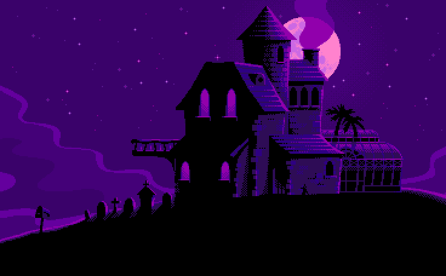

  - 🧑‍💻 Atualmente estou estudando Ciência da Computação no Instituto Federal de SC.

  - 🔭 Estou em busca da minha primeira oportunidade de emprego. 

   
##

 
 

##

## 🔥 Skills
  
 
    
    
    
    
    
    

 
